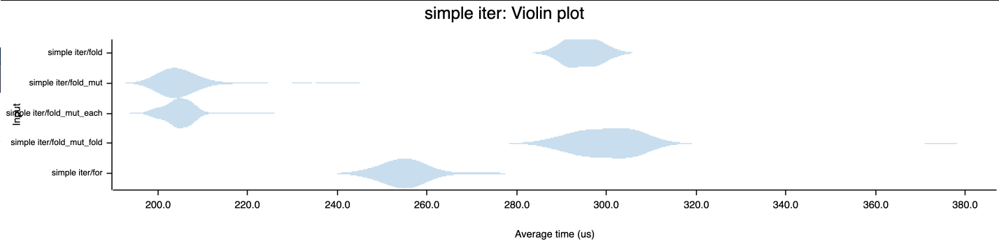
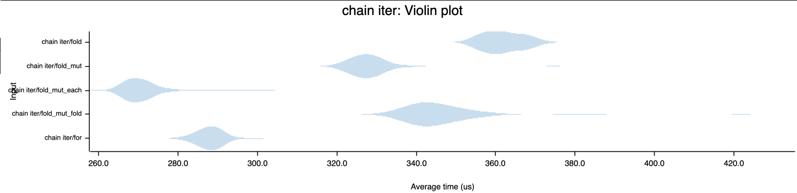
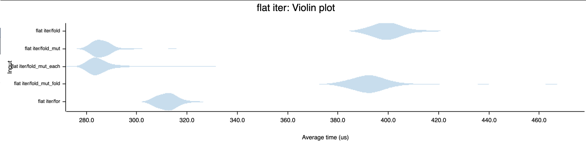

# Fold Comparisons

## Background

This is just me investigating various benchmarks involving `fold()` and `for` loops.
Much of this was kicked off from https://github.com/rust-lang/rust/pull/76746 because
I was confused about the benchmarks being so inconsistent with respect to
https://github.com/rust-lang/rust/issues/76725.

## Fold Options

Five kinds of "folding" are tested:

1. a `for` loop with a manual accumulator
1. the built in `fold` method for the iterator
1. a `fold_mut` method that is a copy-paste of `fold` but with a closure that
   accepts a mutable reference instead of consuming the accumulator
1. a `fold_mut_fold` method that is a mutable-reference-accepting `fold` written
   using the built in `fold` method
1. a `fold_mut_each` method that is a mutable-reference-accepting `fold` written
   using the built in `for_each` method (which is also specialized in some cases)

## Results

### Benchmarks

Benchmarks are run over various iterators. They always fold into a `Vec`. They fold
by adding `n / 3` if `n / 9` (essentially).

Tests are run against three different "kinds" of iterators (to try and catch
differences in specializations like
[Chain::fold](https://doc.rust-lang.org/src/core/iter/adapters/chain.rs.html#107)):

1. a "simple" iterator: `(0i64..100_000).map(black_box)`
1. a "chain" iterator: `(0i64..50_000).chain(0..50_000).map(black_box)`
1. a "flat" iterator: `(0i64..100_000).map(std::iter::once).flat_map(black_box)`

### Nightly Benchmarks

```
test benches::bench_simple_fold_mut_each ... bench:     205,427 ns/iter (+/- 14,061)
test benches::bench_simple_fold_mut      ... bench:     206,109 ns/iter (+/- 10,858)
test benches::bench_simple_for           ... bench:     205,593 ns/iter (+/- 6,094)
test benches::bench_simple_fold_mut_fold ... bench:     290,583 ns/iter (+/- 17,344)
test benches::bench_simple_fold          ... bench:     334,448 ns/iter (+/- 30,638)

test benches::bench_chain_for            ... bench:     233,405 ns/iter (+/- 10,913)
test benches::bench_chain_fold_mut_each  ... bench:     262,161 ns/iter (+/- 11,642)
test benches::bench_chain_fold           ... bench:     317,773 ns/iter (+/- 11,805)
test benches::bench_chain_fold_mut       ... bench:     325,559 ns/iter (+/- 15,385)
test benches::bench_chain_fold_mut_fold  ... bench:     326,741 ns/iter (+/- 18,595)

test benches::bench_flat_fold_mut_each   ... bench:     267,379 ns/iter (+/- 13,452)
test benches::bench_flat_for             ... bench:     285,257 ns/iter (+/- 10,637)
test benches::bench_flat_fold_mut        ... bench:     285,681 ns/iter (+/- 19,304)
test benches::bench_flat_fold            ... bench:     339,382 ns/iter (+/- 26,428)
test benches::bench_flat_fold_mut_fold   ... bench:     435,548 ns/iter (+/- 58,700)
```

It would seem that `fold_mut_each` is pretty fast - that's cool. A `for` loop is usually
around the top too - that's good, there should be "zero" overhead there. `fold` is pretty
fast for a `chain` iterator (probably because of the specialization mentioned above).
For the simple and flat iterators, `fold` and `fold_mut_fold` seem to be the slowest which
is a bit of a bummer for "zero cost abstraction". `fold_mut` handles simple and flat
iterators fairly well but falls apart with the `chain` iterator.

### Criterion Benchmarks

#### Using a "simple" iterator



This looks pretty clearly like `fold_mut and`fold_mut_each`are preferable. It's strange that they'd be faster than the`for` loop so there may be something mischevious going on there.

#### Using a "chain" iterator



`fold_mut_each` takes the cake here which is not what we saw in the nightly tests. It would
seem that `fold` isn't getting its specialization benefits here (at least as much). Could
be a `black_box` bug or something else unfortunate that Criterion might do?

#### Using a "flat" iterator



Here again `fold_mut` and `fold_mut_each` faster than `fold` or `fold_mut_fold`. They're both
faster than a `for` loop which still doesn't make much sense but the overlap in the tails
might identify them as "statistically equivalent" or something.

## Conclusions

I'm not totally sure ... Let me know if you think of any way to tweak the benchmarks
and/or interpret the data in a constructive way!

## To Run

The non-Criterion benches require nightly rust:

```
rustup toolchain install nightly
rustup default nightly
```

and can be run with

```
cargo bench
```

To view Criterion plots, look in `target/criterion/report/index.html`.
